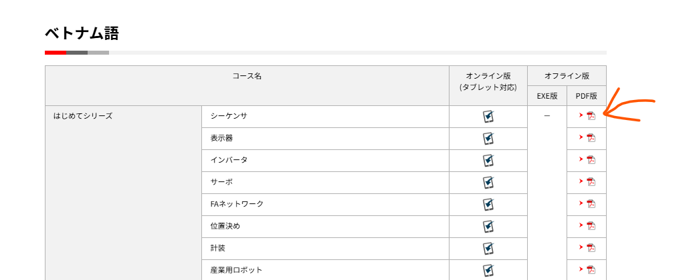
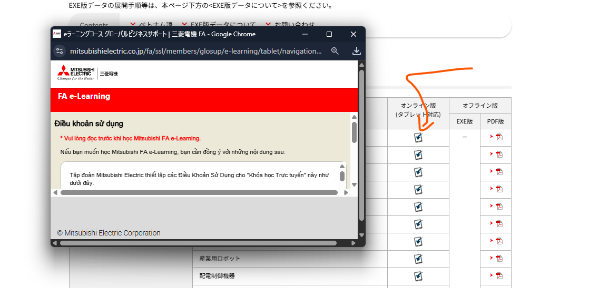
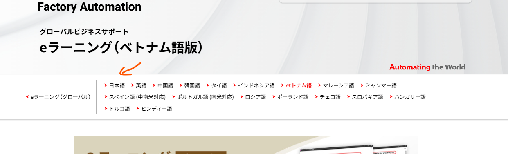

# Lộ trình học Mitsubishi FA

Anh gửi em trình tự học theo hệ thống đào tạo mở của hãng. Hiện Mitsubishi là bộ e-learning open đầy đủ và dễ theo nhất.

## 1. Đăng nhập tài khoản

Em vào [link đăng nhập Mitsubishi FA](https://www.mitsubishielectric.co.jp/fa/ssl/php/members/b_login.php?moto=/fa/index.html&err=/fa/index.html&back=https://www.mitsubishielectric.co.jp/fa/ssl/php/members/logout/logout.php), dùng tài khoản dưới đây. Tài khoản này chỉ dùng cho cá nhân em, không chia sẻ tiếp.

- **Mã thành viên:** `rfq@mrodex.com`
- **Mật khẩu:** `Hokaido123!`

## 2. Học e-learning tiếng Việt

Sau khi đăng nhập, em học từ căn bản đến nâng cao tại trang tiếng Việt:

https://www.mitsubishielectric.co.jp/fa/service-support/global/e-learning/vie.html

Hai nhóm em cần đi hết:

- **はじめてシリーズ** — series nhập môn
- **基礎・応用編** — căn bản và ứng dụng

## 3. Cách mở giáo án

Em có hai cách học. Cách nào cũng được, miễn đi hết series.

**Cách 1.** Trong mục tiếng Việt, bấm biểu tượng PDF ở cột オフライン版 → PDF版 để xem giáo án.

**Cách 2.** Bấm biểu tượng ở cột オンライン版 (タブレット対応) để học trực tiếp trên máy tính. Sau khi bấm, khóa học sẽ khởi tạo ngay trên trình duyệt.

## 4. Giáo án tiếng Nhật

Bộ tiếng Việt đủ để nắm căn bản. Khi muốn đọc bản gốc, em chuyển sang mục **日本語** phía trên trang.

Bộ phía trên tương đối đầy đủ cho giai đoạn căn bản. Em học xong series này rồi hãy đăng ký thi.

## 5. Đăng ký khóa thi và địa điểm học

Khi đã ổn kiến thức, em đăng ký các khóa thi online và chọn địa điểm học:

- Đăng ký khóa / chọn địa điểm: https://www.mitsubishielectric.co.jp/fa/learn/semi/school/index.html?ref=mail20260916
- Các địa điểm học và thi tại Tokyo: https://www.mitsubishielectric.co.jp/fa/learn/semi/school/place/tokyo_fa.html

## 6. Chứng chỉ bắt buộc trước khi đi làm

Để đi làm chính thức tại Nhật trong ngành tự động hóa (FA) và công trường, em cần 3 chứng chỉ dưới đây. Thiếu bất kỳ cái nào cũng không được phép thi công hoặc vận hành hệ thống điện.

### 6a. Điện công hạng 2

**第二種電気工事士** — *Dai-ni-shu Denki Kōji-shi*

**Là gì:** Chứng chỉ hành nghề điện do Bộ Kinh tế Nhật cấp. Đây là chứng chỉ phổ biến nhất và bắt buộc nhất cho người muốn lắp đặt, sửa chữa hệ thống điện.

**Em được phép làm gì:**

- Thi công, lắp đặt đường dây điện trong nhà và tòa nhà (dưới 600V)
- Đấu nối tủ điện, bảng điện, ổ cắm, đèn chiếu sáng
- Sửa chữa, bảo trì hệ thống điện dân dụng và công nghiệp nhẹ

**Ai cần:** Bắt buộc cho tất cả người trực tiếp thi công hệ thống điện tại Nhật. Không có chứng chỉ này thì không được phép chạm vào dây điện trên công trường.

**Kỳ thi:** Thi lý thuyết (筆記試験) + thi thực hành (技能試験). Thi 2 lần/năm (tháng 6 và 10). Đăng ký tại Hiệp hội kiểm tra kỹ năng điện Nhật Bản.

### 6b. Giáo dục đặc biệt về xử lý điện hạ thế

**低圧電気取扱業務特別教育** — *Tei-atsu Denki Toriatsugai Gyōmu Tokubetsu Kyōiku*

**Là gì:** Khóa giáo dục an toàn bắt buộc theo Luật An toàn vệ sinh lao động (労働安全衛生法). Đây không phải kỳ thi mà là khóa học bắt buộc — học xong là được cấp chứng nhận.

**Em được phép làm gì:**

- Vận hành, kiểm tra, bảo dưỡng thiết bị điện hạ thế (dưới 600V) trong nhà máy và công trường
- Xử lý sự cố điện, ngắt/mở cầu dao, đo đạc điện áp, dòng điện
- Làm việc với tủ điều khiển, PLC, biến tần, motor trong hệ thống tự động hóa

**Tại sao cần thêm cái này:** Chứng chỉ Điện công hạng 2 cho phép em *thi công lắp đặt*. Còn chứng chỉ này cho phép em *vận hành, sửa chữa, bảo dưỡng* thiết bị điện hàng ngày trong nhà máy. Hai chứng chỉ bổ sung cho nhau.

**Hình thức:** Học khoảng 6–12 giờ tại cơ sở đào tạo được Bộ Lao động công nhận. Học xong thi trắc nghiệm đơn giản. Không khó như Điện công hạng 2.

**Ai cần:** Bắt buộc cho công nhân trực tiếp xử lý thiết bị điện hạ thế tại nhà máy. Nhân viên kỹ thuật FA, thợ bảo trì, người lắp đặt tủ điều khiển đều cần.

### 6c. Kỹ năng lắp ráp thiết bị điện

**電気機器組立て技能士** — *Denki Kiki Kumitate Ginōshi*

**Là gì:** Chứng chỉ kỹ năng quốc gia (国家資格) về lắp ráp thiết bị điện. Do Bộ Lao động Nhật cấp theo hệ thống kỳ thi kỹ năng nghề (技能検定). Có 3 cấp: cấp 3 (dễ nhất) → cấp 2 → cấp 1 (khó nhất).

**Em được phép làm gì:**

- Lắp ráp tủ điều khiển, tủ phân phối điện, bảng mạch điều khiển
- Lắp đặt PLC, biến tần, relay, aptomat vào tủ điện theo sơ đồ
- Đấu nối dây bên trong tủ điều khiển hệ thống tự động hóa
- Làm việc tại nhà máy sản xuất thiết bị điện, xưởng lắp ráp tủ điều khiển

**Tại sao cần:** Trên công trường và nhà máy Nhật, người ta không để một người chưa có chứng chỉ tự lắp ráp tủ điện hay tủ điều khiển. Đây là cách chứng minh em có tay nghề. Nhiều đơn hàng FA yêu cầu nhân công phải có ít nhất cấp 3 hoặc cấp 2.

**Kỳ thi:** Thi lý thuyết + thi thực hành. Thi qua Hiệp hội phát triển nhân lực Nhật Bản (中央職業能力開発協会). Thi nhiều đợt trong năm tại các trường kỹ thuật trên toàn quốc.

**Gợi ý:** Em nên bắt đầu từ **cấp 3** (không yêu cầu kinh nghiệm), sau đó lên cấp 2 khi có kinh nghiệm thực tế 2–3 năm.

---

### Tóm tắt lộ trình chứng chỉ

① Học Mitsubishi e-learning để nắm kiến thức căn bản về FA →
② Thi **第二種電気工事士** (điện công hạng 2) →
③ Học **低圧電気取扱業務特別教育** (xử lý điện hạ thế) →
④ Thi **電気機器組立て技能士** cấp 3 (lắp ráp thiết bị điện)

Sau khi có đủ 3 chứng chỉ này, em đủ điều kiện làm kỹ thuật viên tự động hóa, lắp đặt và bảo trì thiết bị điện tại nhà máy và công trường ở Nhật.
